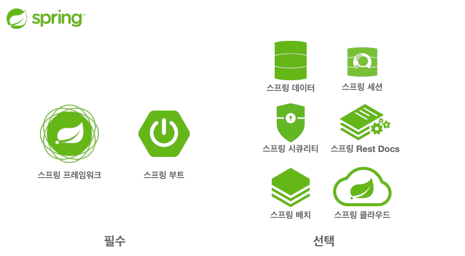

# 01. 객체 지향 설계와 스프링

## 1-1. 스프링이란?



- 스프링 데이터: DB와 연동되는 ORM 등 스프링에서는 JPA가 가장 많이 사용함.

- 스프링 세션: 스프링이 유지하는 세션관리에 관련한 내용

- 스프링 시큐리티: 보안 관련 라이브러리 제공

- 스프링 클라우드: 클라우드 기반 편의 기능 제공

- 스프링 배치: 배치 작업을 스프링 내에서 원활하게 할 수 있는 라이브러리 제공

`스프링과 스프링 부트`

가장 큰 차이 -> Tomcat 같은 웹 서버 등을 설치하지 않아도 됨.

starter 종속성 제공 -> 다양한 라이브러리 버전 호환을 자동으로 추천해줍니다.

<br>

`스프링의 진짜 핵심`

- 자바 언어의 가장 큰 특징 - 객체 지향 언어

- 스프링은 객체 지향 언어가 가진 특징을 살려내는 프레임워크

- 스프링은 좋은 객체 지향 애플리케이션을 개발할 수 있게 도와준다.

## 1-2. 좋은 객체 지향 프로그래밍이란?

`객체 지향 특징`

- 추상화

- 캡슐화

- 상속

- 다형성

<br>

`객체 지향 프로그래밍`

객체는 메시지를 주고 받고, 데이터를 처리할 수 있다.

프로그램을 **유연하고 변경이 용이**하게 바꿀 수 있다.

<br>

`역할과 구현의 분리`

- 자바 언어의 다형성을 활용
  
  - 역할 = 인터페이스
  
  - 구현 = 인터페이스를 구현한 클래스, 구현 객체 등

- 객체를 설계할 때 역할과 구현을 명확히 분리

- 객체 설계시 역할(인터페이스)을 먼저 부여하고, 그 역할을 수행하는 구현 객체 만들기

<br>

`스프링과 객체 지향`

- 다형성이 가장 중요하다

- 스프링은 다형성을 극대화하여 이용할 수 있게 도와준다.

- 스프링에서 이야기하는 제어의 역전(IoC), 의존성 주입(DI)는 다형성을 활용하여 역할과 구현을 편리하게 다룰 수 있도록 해줌.

<br>

## 1-3. 좋은 객체 지향 설계의 5자기 원칙(SOLID)

- **SRP: 단일 책임의 원칙(Single Responsibility Principle)**
  
  - 한 클래스는 하나의 책임만 가져야 한다.
  
  - 하나의 책임이라는 것은 모호하다.
    
    - 책임이 클 수도 있고, 작을 수 있다.
    
    - 문맥과 상황에 따라 다르다.
  
  - 따라서, **중요한 기준은 변경**이다. 변경이 있을 때, 파급 효과가 적으면 단일 책임 원칙을 잘 따랐다고 볼 수 있다.

<br>

- **OCP: 개방-폐쇄 원칙(Open/Closed Principle)**
  
  - 소프트웨어 요소는 확장에는 열려 있으나 변경에는 닫혀 있어야 한다.
  
  - 다형성을 활용해봅시다.
  
  - 인터페이스를 구현한 새로운 클래스를 하나 만들어서 새로운 기능 구현
  
  `문제점`
  
  ```java
  MemberRepository m = new MemoryMemberRepository(); // 기존 코드
  MemberRepository m = new JdbcMemberRepository(); // 변경 코드
  // 설명
  // 구현 객체를 변경하기 위해 클라이언트 코드를 변경해야하는 문제 발생
  ```
  
  <br>
  
  -> 다형성을 사용했지만, OCP 원칙을 지킬 수 없다.
  -> 객체를 생성하고, 연관관계를 맺는 별도의 조립, 설정자가 필요하다.

<br>

- **LSP: Liskov Substitution Principle(리스코프 치환 원칙)**
  
  - 프로그램 객체는 프로그램의 정확성을 깨뜨리지 않으면서 하위 타입의 인스턴스로 바꿀 수 있어야 한다.
  
  - 다형성에서 하위 클래스는 인터페이스 규약을 다 지켜야한다는것, 다형성을 지원하기 위한 원칙, 인터페이스를 구현한 구현체를 믿고 사용하려면 이 원칙이 필요한다.
  
  - 단순히 컴파일에 성공하는 것을 넘어서는 이야기

<br>

- **ISP: Interface segregation Principle(인터페이스 분리 원칙)**
  
  - 특정 클라이언트를 위한 인터페이스 여러 개가 범용 인터페이스 하나보다 낫다.
  
  - 자동차 인터페이스 -> 운전 인터페이스, 정비 인터페이스로 분리
  
  - 사용자 클라이언트 -> 운전 클라이언트, 정비사 클라이언트로 분리
  
  - 분리하면 정비 인터페이스 자체가 변해도 운전자 클라이언트에 영향을 주지 않음
  
  - 인터페이스가 명확해지고, 대체 가능성이 높아진다.

<br>

- DIP: 의존관계 역전 원칙(Dependency Inversion Principle)
  
  - 프로그래머는 추상화에 의존해야지, 구체화에 의존하면 안된다. "의존성 주입은 이 원칙을 따르는 이야기"

-> 다형성만으로 클라이언트에 대한 의존을 막을 수 없다. -> 어떻게 해야하는가?

<br>

## 1-4. 객체 지향 설계와 스프링

`스프링의 객체 지향`

- 스프링은 다형성 + DCP, DIP를 가능하게 지원한다.
  
  - DI(Dependency Injection): 의존관계, 의존성 주입
  
  - DI 컨테이너 제공

- 클라이언트의 코드 변경 없이 가능

### 정리

- 모든 설계에 역할(Interface)과 구현(구현한 클래스 등)을 분리해야한다.

- 이상적으로는 모든 설계에 인터페이스를 부여하자
